# Predictable Revenue Report — AssetLift Lending

**Date:** February 12, 2026
**NMLS#:** 1324403
**Framework:** Aaron Ross / Predictable Revenue methodology

---

## Current Score: 2 / 10

| Dimension | Score | Notes |
|-----------|-------|-------|
| Role Specialization | 0/10 | No separation of prospecting vs closing |
| Outbound Process (Spears) | 0/10 | No Cold Calling 2.0, no SDR function |
| Inbound Engine (Nets) | 3/10 | SEO foundation exists, 4 blog posts, AI chatbot |
| Referral Engine (Seeds) | 0/10 | No referral program, no NPS, no post-close process |
| CRM & Pipeline Tracking | 1/10 | Leads go to email inbox, no pipeline visibility |
| Conversion Tracking | 1/10 | GA installed but no event tracking on forms/chat |
| Email Nurture | 0/10 | No follow-up sequences after application |
| Pipeline Predictability | 0/10 | Cannot forecast revenue 30, 60, or 90 days out |

---

## Lead Type Analysis

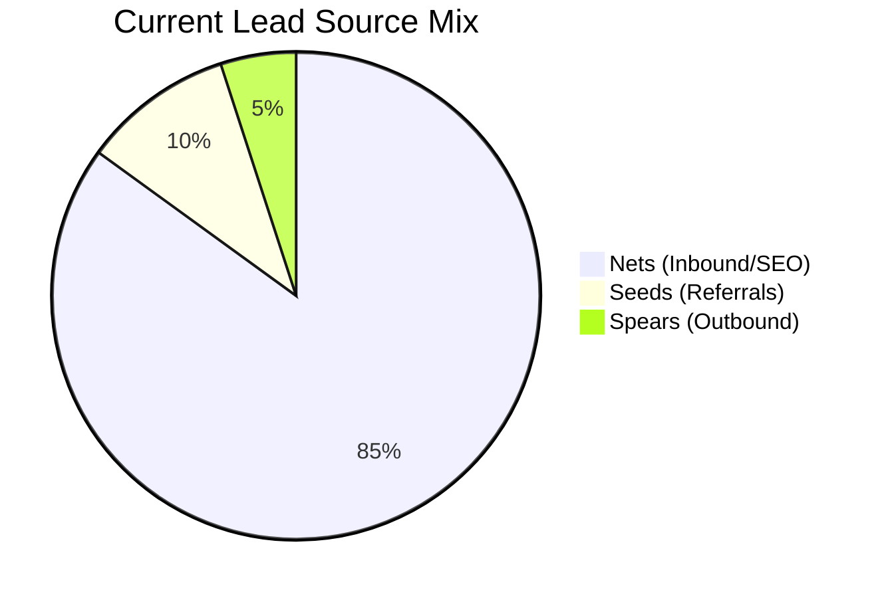

**Target mix at maturity (Month 12):**

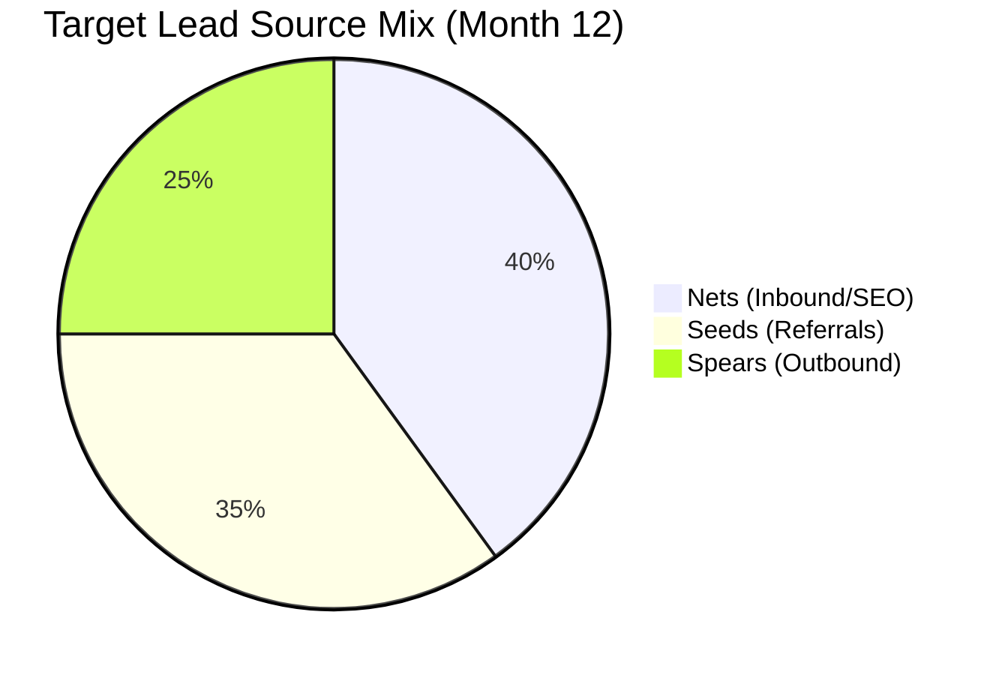

Seeds (referrals from funded borrowers) should become the largest source over time — they convert at 3-5x the rate of cold leads and cost almost nothing.

---

## Revenue Pipeline Math

### Assumptions

| Metric | Value |
|--------|-------|
| Average loan size | $450,000 |
| Origination fee | 2 points (2%) |
| **Revenue per funded loan** | **$9,000** |
| Application-to-funded rate | 20% |
| Website visitor-to-application rate | 5% |
| Outbound response rate (Cold Calling 2.0) | 10% |
| Outbound response-to-application rate | 15% |
| Referral-to-application rate | 40% |

### Year 1 Revenue Model

```
 Annual Revenue Goal           $540,000
 ÷ Revenue per loan              $9,000
 ────────────────────────────────────────
 Loans needed                        60  (5 per month)
 ÷ Win rate                         20%
 ────────────────────────────────────────
 Applications needed                300  (25 per month)
```

### How to Get 25 Applications / Month

| Channel | Monthly Volume | Conversion | Applications |
|---------|---------------|------------|-------------|
| **Nets** (SEO + content + chatbot) | 2,000 visitors | 5% | 10 |
| **Spears** (Cold Calling 2.0) | 1,500 emails | 10% respond → 15% apply | 8 |
| **Seeds** (referrals from funded deals) | 18 referral asks | 40% | 7 |
| **Total** | | | **25** |

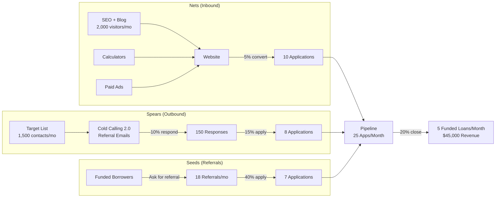

---

## Sales Funnel — Full Journey

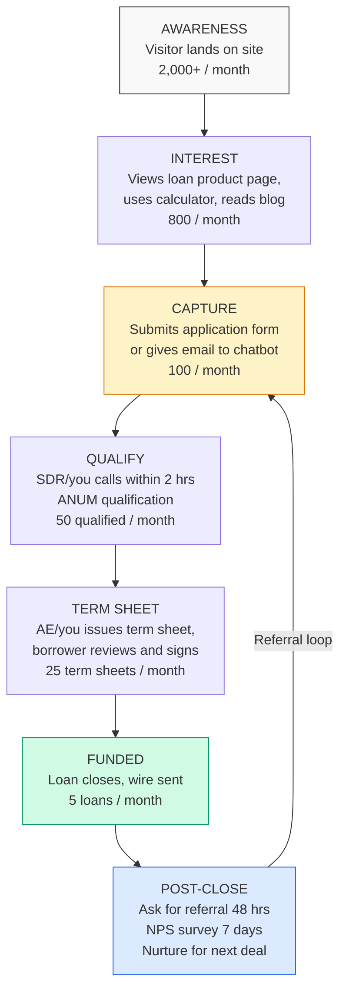

---

## Cold Calling 2.0 — Outbound Playbook

### Ideal Customer Profile (ICP)

| Attribute | Target |
|-----------|--------|
| **Who** | Real estate investors doing 2+ deals/year |
| **Deal size** | $100K – $5M per asset |
| **Strategy** | Fix and flip, BRRRR, rental portfolios, new construction |
| **Geography** | 46 U.S. states (exclude AK, ND, SD, VT) |
| **Where to find** | BiggerPockets, LinkedIn, REI meetups, title companies, real estate agents |
| **Pain points** | Slow bank financing, need to close fast, need higher leverage |

### The Referral Email Sequence

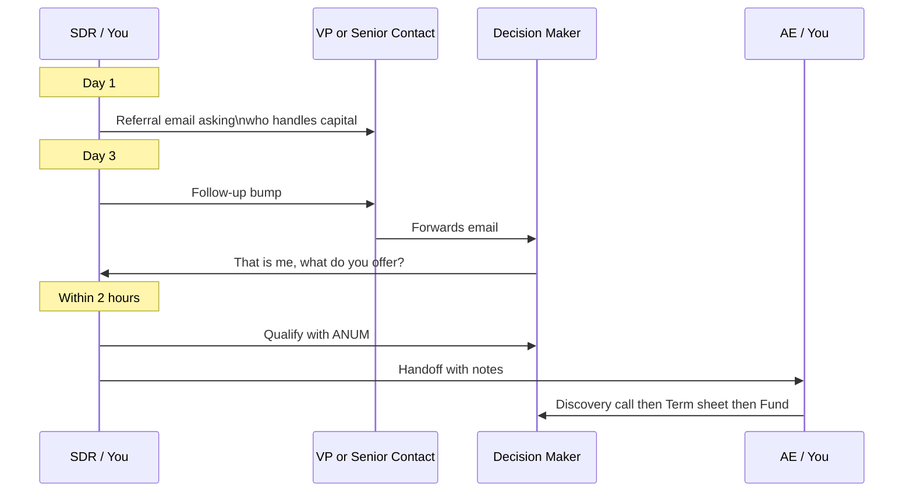

### Email Templates

**Day 1 — Referral Email**

> **Subject:** Quick question
>
> Hi [Name],
>
> I'm not sure if you're the right person, but I was hoping you could point me in the right direction.
>
> We're a direct private lender that funds fix and flip, DSCR, and bridge loans — typically closing in 7-10 days with up to 90% LTC.
>
> Do you work with any investors who could use a fast, reliable capital source?
>
> Thanks,
> [Your name]
> AssetLift Lending | NMLS# 1324403

**Day 3 — Follow-Up**

> Hi [Name],
>
> Just bumping this up — would you happen to know the right person to talk to about investment financing at [Company/Group]?
>
> Thanks,
> [Your name]

**Day 7 — Different Angle**

> Hi [Name],
>
> One more try — we just funded a $650K fix and flip in [their state] in 8 days. If you know any investors looking for that kind of speed, I would love an introduction.
>
> [Your name]

**Day 14 — Break-Up Email**

> Hi [Name],
>
> Have not heard back — no worries at all. Should I close your file, or would it make sense to connect?
>
> [Your name]

---

## Role Specialization Plan

### Current State (1-Person Team)

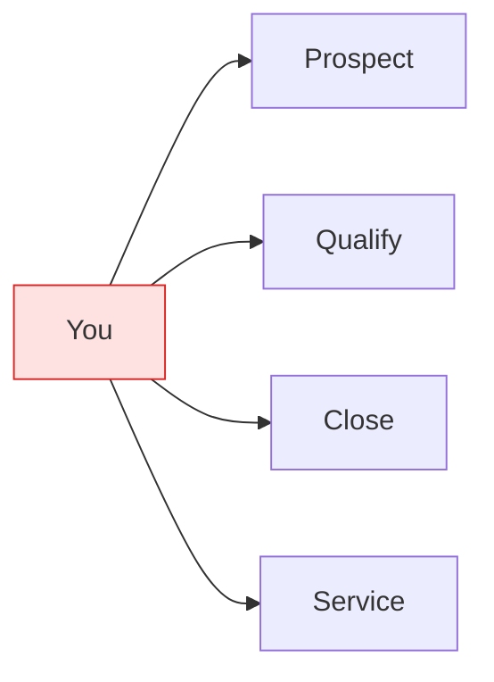

**Problem:** Everything depends on one person. Pipeline is feast-or-famine.

### Phase 1 — Time Blocking (Now)

| Time Block | Mon | Tue | Wed | Thu | Fri |
|------------|-----|-----|-----|-----|-----|
| 8-10 AM | Prospect | Prospect | Prospect | Prospect | Prospect |
| 10-12 PM | Qualify | Close | Qualify | Close | Qualify |
| 1-3 PM | Close | Close | Close | Close | Seeds/Referrals |
| 3-5 PM | Content/SEO | Follow-ups | Content/SEO | Follow-ups | Review metrics |

### Phase 2 — First Hire: Virtual SDR (Month 3-4)

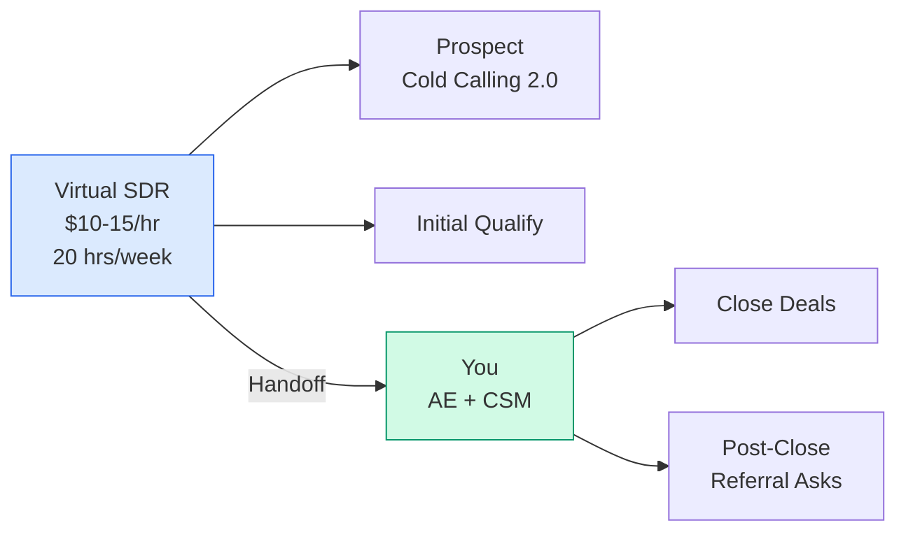

**Cost:** ~$800-1,200/month
**Expected output:** 10-20 qualified opportunities/month

### Phase 3 — Full Team (Month 8-12)

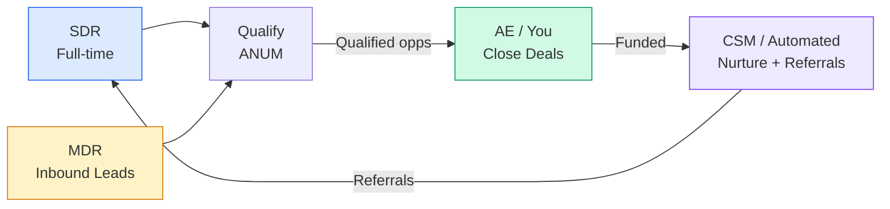

---

## ANUM Qualification Framework

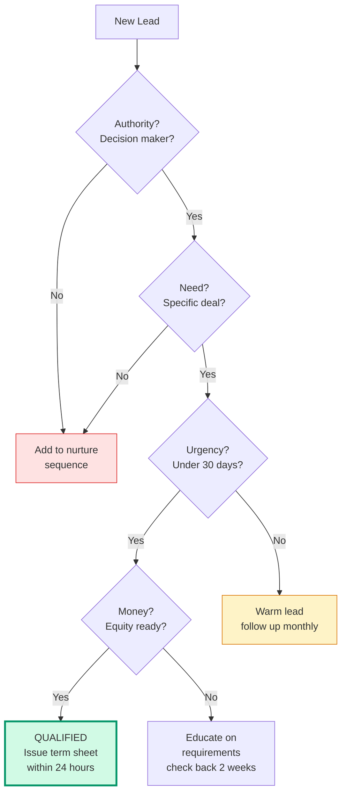

| Criteria | Questions to Ask | Green Light | Red Flag |
|----------|-----------------|-------------|----------|
| **Authority** | Are you the one making the financing decision? | Decision maker, entity owner | Just looking for a friend |
| **Need** | Do you have a property under contract? | Contract signed, address known | Just browsing, no deal |
| **Urgency** | When do you need to close? | Within 30 days, competing offer | Sometime this year |
| **Money** | Do you have the down payment ready? | Proof of funds available | No cash reserves |

---

## 12-Month Revenue Forecast

| Month | Nets | Spears | Seeds | Total Apps | Loans Funded | Monthly Revenue |
|-------|------|--------|-------|------------|-------------|----------------|
| 1 | 5 | 0 | 0 | 5 | 1 | $9,000 |
| 2 | 7 | 2 | 0 | 9 | 2 | $18,000 |
| 3 | 8 | 4 | 1 | 13 | 3 | $27,000 |
| 4 | 10 | 6 | 2 | 18 | 4 | $36,000 |
| 5 | 11 | 7 | 2 | 20 | 4 | $36,000 |
| 6 | 13 | 8 | 3 | 24 | 5 | $45,000 |
| 7 | 14 | 8 | 4 | 26 | 5 | $45,000 |
| 8 | 16 | 9 | 5 | 30 | 6 | $54,000 |
| 9 | 17 | 9 | 5 | 31 | 6 | $54,000 |
| 10 | 18 | 10 | 6 | 34 | 7 | $63,000 |
| 11 | 19 | 10 | 7 | 36 | 7 | $63,000 |
| 12 | 20 | 10 | 7 | 37 | 7 | $63,000 |
| **Total** | **158** | **83** | **42** | **283** | **57** | **$513,000** |

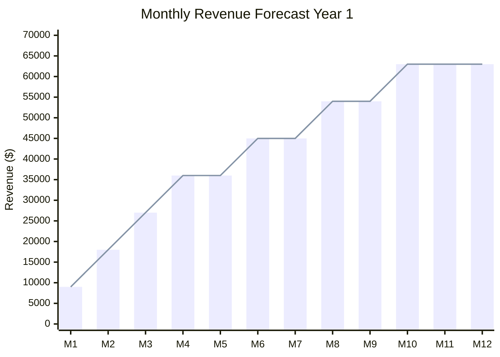

### Key Milestones

| Milestone | Target Month | Trigger |
|-----------|-------------|---------|
| First outbound-sourced loan funded | Month 3 | SDR function active for 60 days |
| First referral-sourced loan funded | Month 4 | 10+ loans funded total |
| $45K monthly revenue (breakeven+) | Month 6 | All 3 channels producing |
| Hire first VA/SDR | Month 4 | Revenue covers $1K/mo cost |
| 5 loans/month sustained | Month 8 | Pipeline is predictable |
| $500K annual run rate | Month 10 | Compounding referral engine |

---

## Referral Engine (Seeds) Playbook

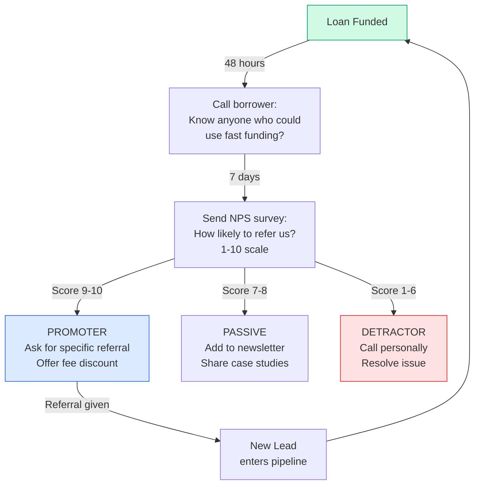

**Referral incentive structure:**
- Referrer gets 0.25 points off origination on their next deal
- Referred borrower gets 0.25 points off on first deal
- Both parties win — creates viral loop

---

## Metrics Dashboard

### What to Track Weekly

| Category | Metric | Target | Current |
|----------|--------|--------|---------|
| **Activity** | Outbound emails sent | 300/week | 0 |
| **Activity** | Blog posts published | 2/week | < 1/week |
| **Pipeline** | New applications received | 6/week | ~2/week |
| **Pipeline** | Qualified opportunities | 3/week | Unknown |
| **Pipeline** | Term sheets issued | 2/week | Unknown |
| **Revenue** | Loans funded | 1/week | Unknown |
| **Revenue** | Revenue this month | $36K+ | Unknown |
| **Efficiency** | Cost per application | < $50 | ~$0 |
| **Efficiency** | Application-to-funded rate | 20%+ | Unknown |
| **Growth** | Referrals received | 2/week | 0 |

### Leading vs Lagging Indicators

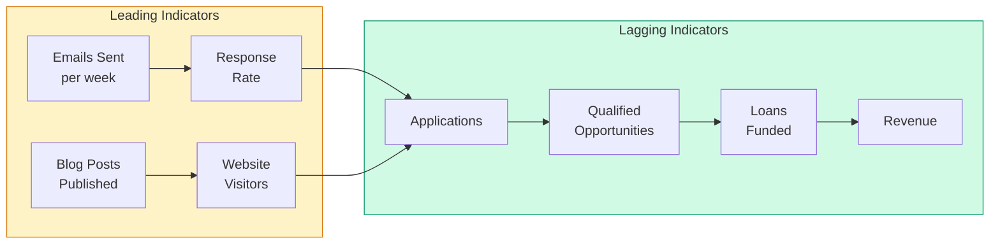

---

## Implementation Roadmap

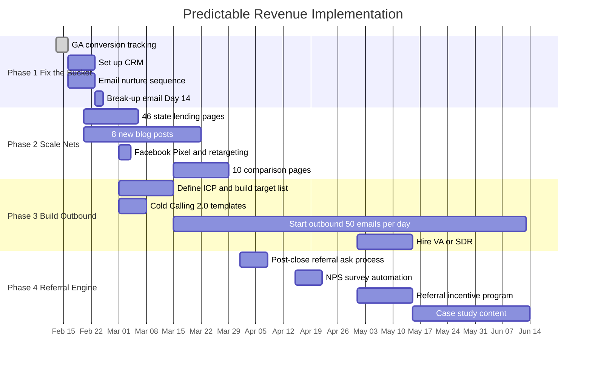

---

## Common Mistakes to Avoid

| Mistake | Why It Kills Revenue | Fix |
|---------|---------------------|-----|
| Leads rotting in email inbox | No follow-up = no close | CRM + 2-hour response SLA |
| Long pitchy outbound emails | Low response rate | Short referral email under 80 words |
| Only doing inbound marketing | SEO takes 6+ months to compound | Start outbound in parallel NOW |
| Not asking for referrals | Best lead source left on table | Ask every funded borrower within 48 hrs |
| Prospecting and closing same time | Feast-or-famine pipeline | Time-block or hire SDR |
| No conversion tracking | Cannot measure what works | GA events on every form submit |
| Treating all leads the same | Wasting time on unqualified | ANUM qualification on every lead |

---

## The Predictable Revenue Formula

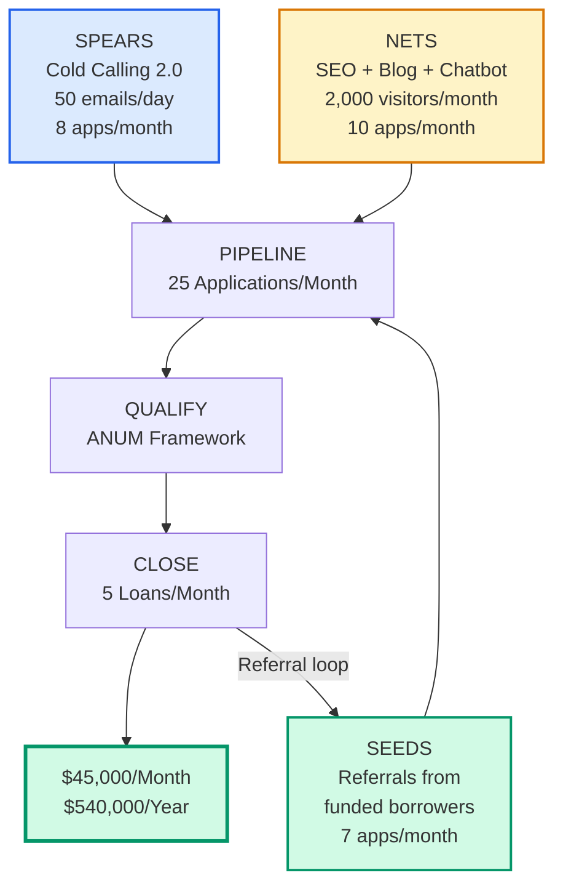

---

## Next Steps (This Week)

- [ ] Set up Google Search Console and submit sitemap
- [ ] Implement GA conversion events on application form + chatbot
- [ ] Choose CRM (HubSpot Free or Supabase-based)
- [ ] Write 5-email nurture sequence for new applicants
- [ ] Build target account list (first 200 contacts)
- [ ] Draft Cold Calling 2.0 email templates
- [ ] Start publishing 2 blog posts per week
- [ ] Generate city-level lending pages for programmatic SEO

---

*Report generated using the [Predictable Revenue](https://www.amazon.com/Predictable-Revenue-Business-Practices-Salesforce-com/dp/0984380213) framework by Aaron Ross. Adapted for private lending / hard money vertical.*
